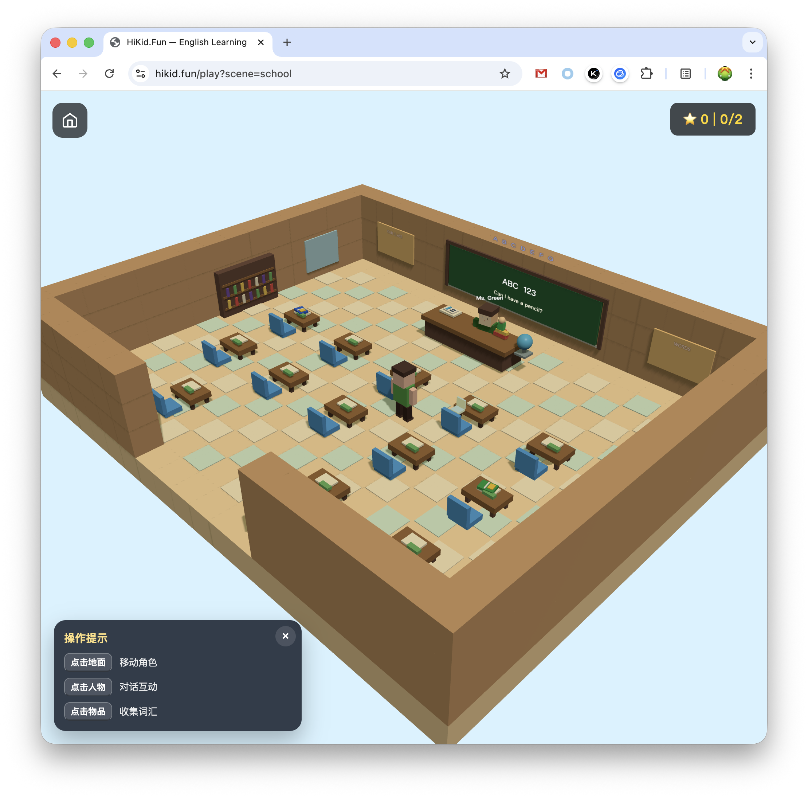

# HiKid.Fun 🎮

> Three.js 体素场景引擎 —— 为 6-12 岁儿童打造的沉浸式英语口语学习世界

在线演示：[https://hikid.fun](https://hikid.fun)

## 这是什么

一个 Minecraft 风格的 3D 体素世界，孩子们在其中自由探索、与 NPC 对话，在游戏中自然习得英语口语和听力。引擎封装了渲染、语音合成、语音识别、意图理解和智能计分——老师或 AI 只需写完 YAML/JSON 配置文件，就能快速生成新的教学场景。

## 当前状态

当前项目仍处在技术探索阶段，核心目标是验证「3D 体素场景 + 语音交互 + LLM 意图理解」能否成为一种自然、有趣的儿童英语口语学习体验。引擎接口、场景 Schema、语音管线和交互方式都还可能继续调整，不建议把当前版本视为稳定的课程生产框架。

仓库中已经包含餐厅、学校、动物园、机场、酒店等场景，孩子可以在 3D 世界里探索、与 NPC 对话、收集词汇物件；首页会展示场景进度、总积分和词汇图鉴。不过这些场景更偏向 Demo 演示，用来验证引擎能力和交互体验，而不是已经完成教研设计的正式课程。

更理想的方向，是把成熟的英语教学理念、分级阅读、情境对话或新概念类课程结构，转化为可探索、可对话、可反馈的学习场景。但真实课程内容通常涉及版权、授权和改编边界，因此后续需要寻找合适的开放教材、可授权资源，或与教研人员共同设计原创场景。非常欢迎英语老师、课程设计者和家长参与进来，一起讨论什么样的任务、词汇、对话和反馈方式真正适合 6-12 岁儿童。

等引擎逐步成熟后，计划增加「创建场景」相关的技能和工具，让非开发人员也可以用结构化配置、模板或 AI 辅助流程创建新的学习场景。也就是说，长期目标不是只由开发者写代码扩展内容，而是让教研人员能够把教学想法直接转化成可玩的英语学习世界。

## 界面预览

<table>
  <tr>
    <td width="50%">
      
    </td>
    <td width="50%">
      
    </td>
  </tr>
  <tr>
    <td align="center">首页场景选择与学习进度</td>
    <td align="center">学校场景中的 NPC 对话任务</td>
  </tr>
  <tr>
    <td width="50%">
      
    </td>
    <td width="50%">
      
    </td>
  </tr>
  <tr>
    <td align="center">农场场景探索与词汇收集</td>
    <td align="center">词汇图鉴与学习成果回顾</td>
  </tr>
</table>

## 玩法介绍

进入首页后，孩子可以选择一个已解锁的场景开始学习。每个场景都是一个可探索的 3D 体素世界，例如餐厅点餐、学校问路、机场办理登机或酒店入住。

进入场景后，靠近 NPC 或发光的词汇物件会出现互动提示。孩子可以点击画面锁定鼠标，用 WASD 移动视角和角色；靠近 NPC 后按住说话按钮，用英语回答问题或完成任务，松开按钮后系统会识别语音、理解意图，并由 NPC 给出下一句回应。

学习目标以任务形式藏在场景互动中：说出合适的句子、完成一次对话、找到并收集目标词汇，都可以获得积分。完成场景后，进度会回到首页展示；收集过的词汇也会进入词汇图鉴，方便孩子回顾自己在不同场景里学到的表达。

## 开始使用

```bash
# 1. 安装依赖
npm install
cd server && npm install && cd ..

# 2. 安装本地 TTS 二进制和模型
#    需要准备 server/bin 下的平台二进制，以及 server/model/kitten_tts_micro_v0_8.onnx
#    具体下载和放置方式见 docs/deployment.md 的“安装 Kitten TTS 二进制和模型”

# 3. 配置文本大模型 Key
export DEEPSEEK_API_KEY="your-deepseek-key"

# 4. 启动后端代理（终端 1）
npm run server:dev

# 5. 启动前端（终端 2）
npm run dev
```

打开 http://localhost:5173 进入首页。选择一个已解锁场景后，点击画面锁定鼠标，WASD 移动，走到 NPC 或词汇物件旁边按提示互动。

## 学习数据

进度、分数、单词收集记录和偏好保存在当前浏览器里。首页右上角积分面板里有 `Data` 按钮，可以导出、导入或重置这份学习数据。

这种方式适合开源自部署和在线体验：部署者只需要提供服务能力，学习者的数据默认留在自己的浏览器中。需要换浏览器或换设备时，使用 `Data` 导出 JSON，再在新浏览器中导入即可。

## 成本控制

语音识别默认在浏览器本地运行，不需要配置云端 ASR key。如果配置了 `GLM_API_KEY`，ASR 自动走后端转发至智谱云端，识别效果更好（尤其对儿童语音），服务端有频率限制保护。

文本 AI 调用统一经过后端网关，默认使用 `DEEPSEEK_API_KEY`；`DEEPSEEK_MODEL` 可选。

TTS 由后端代理本地 Kitten TTS 服务完成。相同文本、声音和语速会缓存为 WAV 文件；缓存命中时直接返回音频，缓存未命中时才生成新音频并计入 TTS 额度。

可选额度配置：

```bash
AI_DAILY_LIMIT=5000          # 全站每天文本 AI 请求数
AI_IP_HOURLY_LIMIT=300       # 单 IP 每小时文本 AI 请求数
TTS_DAILY_LIMIT=10000        # 全站每天 TTS cache-miss 生成数
TTS_IP_HOURLY_LIMIT=600      # 单 IP 每小时 TTS cache-miss 生成数
ASR_DAILY_LIMIT=5000         # 全站每天 ASR 请求数（仅云端模式）
ASR_IP_HOURLY_LIMIT=300      # 单 IP 每小时 ASR 请求数（仅云端模式）
TTS_CACHE_DIR=server/data/tts-cache
EXAMPLE_CACHE_DIR=server/data/example-cache
CORS_ORIGIN=https://learn.example.com
TRUST_PROXY=true
SERVER_BODY_LIMIT=262144
```

后端还提供 `GET /api/quota` 查看当前请求 IP 对应的 AI/TTS/ASR 剩余额度。

## 技术架构

```
                    ┌─────────────────┐
                    │  场景配置 (YAML)  │
                    │  教师 / AI 编写   │
                    └────────┬────────┘
                             │ load & validate
                    ┌────────▼────────┐
                    │   场景引擎        │
                    │                  │
                    │  ┌─────────────┐ │         ┌──────────┐
                    │  │ Voxel 渲染器 │◄─────────│ Three.js │
                    │  └─────────────┘ │         └──────────┘
                    │                  │
                    │  ┌─────────────┐ │  audio  ┌──────────────┐
   🎤 按住说话       │  │ 语音流水线    │◄────────│ Local Whisper │
──────► 松开发送 ────│──│ ASR→Intent │ │  text   │ 或云端 GLM   │
                    │  │ TTS ◄ NPC  │─┼────────►│              │
                    │  └─────────────┘ │         └──────────────┘
                    │                  │
                    │  ┌─────────────┐ │         ┌──────────┐
                    │  │ 意图路由器    │◄────────│ AI 网关   │
                    │  │ (LLM 匹配)   │ │  intent │ DeepSeek │
                    │  └─────────────┘ │         └──────────┘
                    │                  │
                    │  ┌─────────────┐ │
                    │  │ 计分 & 状态机 │ │
                    │  └─────────────┘ │
                    └──────────────────┘
```

## 命令

```bash
npm run dev          # Vite 开发服务器 (:5173)
npm run build        # 生产构建
npm run server:dev   # Fastify 后端代理 (:3001)
```

部署到公网前请阅读 [部署指南](docs/deployment.md)，其中包含服务端接口清单、安全检查和反向代理示例。

## 目录结构

```
hi-kid-fun/
├── src/engine/          # 引擎核心
│   ├── renderer/        # Three.js 体素渲染
│   ├── voice/           # TTS、ASR、意图路由、麦克风 UI
│   ├── runtime/         # 会话状态机、场景加载
│   ├── scoring/         # 计分
│   └── schema/          # 场景配置类型 + 校验
├── src/scenes/          # 场景定义（restaurant/school/zoo/airport/hotel）
├── server/              # 后端 API 代理（TTS、文本 AI、场景元数据、额度）
├── docs/
│   ├── brainstorms/     # 需求文档
│   └── plans/           # 规划文档
└── tests/               # 测试
```

## 添加新场景

创建一个场景配置文件：

```typescript
// src/scenes/clinic/config.ts
import type { SceneConfig } from '../../engine/schema/SceneConfig.js';

export const clinicConfig: SceneConfig = {
  schemaVersion: '1.0',
  name: 'Clinic',
  description: 'Visit the doctor and describe your symptoms.',
  cefrLevel: 'A1',
  targetVocabulary: ['headache', 'fever', 'cough'],
  map: { /* ... */ },
  npcs: [
    {
      id: 'doctor',
      name: 'Dr. Smith',
      role: 'A friendly doctor who asks about your symptoms.',
      position: { x: 4, y: 0, z: 4 },
      appearance: 'doctor_female_01',
      voice: 'expr-f-01',
      speechSpeed: 0.9,
      interaction: { type: 'proximity', radius: 3 },
      dialogueTree: [
        {
          id: 'greeting',
          npcText: "Hello! What seems to be the problem?",
          hintExamples: ['I have a headache', 'I feel sick'],
          candidateIntents: [
            {
              intentId: 'describe_symptom',
              description: 'The child describes a health symptom or how they feel',
              nextNodeId: 'diagnose',
            },
          ],
        },
        // ...
      ],
    },
  ],
  tasks: [
    {
      id: 'describe_symptom',
      description: 'Tell the doctor what is wrong.',
      trigger: { type: 'dialogue_node', npcId: 'doctor', nodeId: 'greeting' },
      targetIntent: 'describe_symptom',
      scoreReward: 10,
    },
  ],
};
```

然后新增 `src/scenes/clinic/index.ts` 导出 `{ id, config, hooks, createVisuals, animateVisuals }`。前端会通过 `src/main.ts` 和 `server/src/routes/scenes.ts` 的场景目录扫描加载它。

## 技术栈

| 层 | 方案 |
|---|---|
| 渲染 | Three.js 0.184.0 + InstancedMesh |
| TTS | Kitten TTS server + 磁盘缓存 |
| ASR | 浏览器本地 Whisper；可选云端 GLM-ASR |
| 意图路由 | DeepSeek Chat（后端统一网关） |
| 学习数据 | 浏览器本地 LearningDataStore |
| 状态机 | XState v5 |
| 构建 | Vite + TypeScript |
| 后端 | Fastify |
