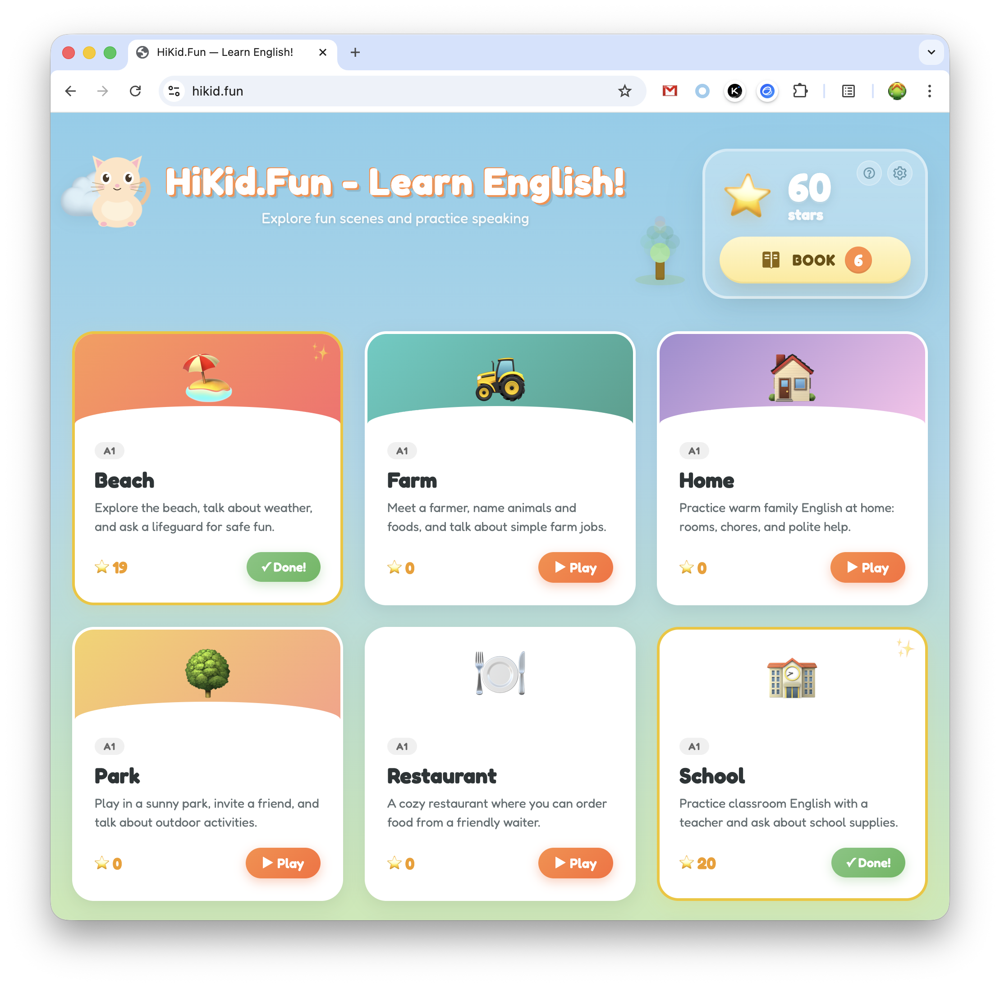
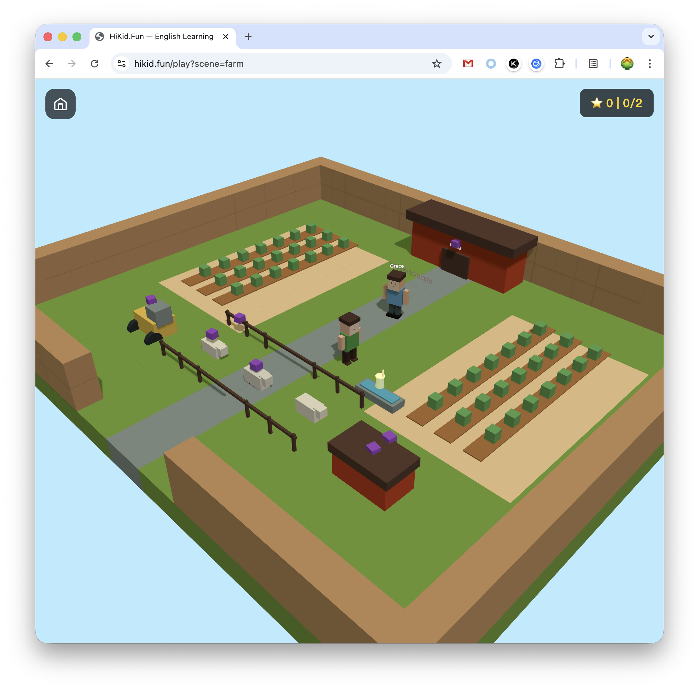
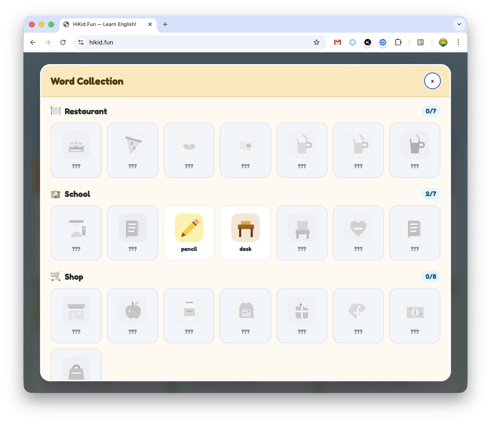

# HiKid.Fun 🎮

> A Three.js voxel-scene engine for immersive English speaking practice for children ages 6–12.

Live demo: [https://hikid.fun](https://hikid.fun)

## What This Project Is

HiKid.Fun is a Minecraft-style 3D voxel world where children explore, interact with NPCs, collect vocabulary objects, and practice English through contextual tasks. The engine encapsulates rendering, speech synthesis, speech recognition, intent understanding, scoring, and session flow so that new learning scenes can be defined through structured configuration.

The EngKid fork adds a new **Space Rescue Lab** scene and a pedagogy layer focused on meaningful production, adaptive scaffolding, learner evidence, and transfer rather than simple repetition.

## Current Status

This project is still an experimental learning platform rather than a finished curriculum product. Its main purpose is to test whether **3D exploration + spoken interaction + intent understanding + adaptive tutoring** can create a natural and engaging English-learning experience for children.

The repository includes scenes such as restaurant, school, zoo, airport, hotel, farm, home, park, beach, and Space Rescue Lab. These scenes primarily validate the engine and interaction model. They should not yet be treated as a complete research-backed curriculum.

The long-term direction is to combine strong language-learning principles with interactive scenarios, graded content, information-gap tasks, reasoning, and AI-assisted dialogue while keeping the game engine deterministic and pedagogically controlled.

## Interface Preview

<table>
  <tr>
    <td width="33%"></td>
    <td width="33%"></td>
    <td width="33%"></td>
  </tr>
  <tr>
    <td align="center">Scene selection and learning progress</td>
    <td align="center">Farm exploration and vocabulary collection</td>
    <td align="center">Vocabulary collection and learning review</td>
  </tr>
</table>

## How It Works

From the portal, a child chooses an unlocked scene and enters an explorable 3D world. Depending on the scene, the child can move through the environment, approach NPCs, interact with objects, speak English, complete tasks, and earn points.

The original engine supports Push-to-Talk speech interaction. The child holds the microphone control while speaking, releases it to submit the utterance, and the app transcribes the speech, routes the meaning to an intent, and advances the NPC dialogue when appropriate.

Learning goals are embedded in interactions rather than shown only as worksheets. A child may need to ask a question, choose an object, explain a reason, complete a conversation, or collect target vocabulary.

## EngKid Space Rescue MVP

The current EngKid MVP adds a native HiKid scene called **Space Rescue Lab**.

Core learning flow:

1. **Listen & Explore** — understand an instruction such as “Find the red planet.”
2. **Ask the Robot** — form a question such as “Where is the battery?”
3. **Prepare the Rocket** — choose useful items and explain the choice with language such as `because`, `should`, and `need`.
4. **Transfer Challenge** — change the destination from Mars to the Moon and ask the learner to reconsider the same language in a new context.

The TutorEngine remains the pedagogical authority. An LLM may later help interpret language or generate replies, but it should not directly control game state.

## Getting Started

```bash
# 1. Install frontend dependencies
npm install

# 2. Install backend dependencies
cd server && npm install && cd ..

# 3. Configure the text-AI key
export DEEPSEEK_API_KEY="your-deepseek-key"

# 4. Start the backend proxy in terminal 1
npm run server:dev

# 5. Start the frontend in terminal 2
npm run dev
```

Open `http://localhost:5173` in your browser.

For local Kitten TTS, provide the platform-specific server binary under `server/bin` and the model under `server/model`. See [docs/deployment.md](docs/deployment.md) for deployment details.

## Learning Data

Progress, scores, collected vocabulary, and preferences are stored in the current browser. `LearningDataStore` supports export, import, and reset so the project can remain simple and privacy-friendly without requiring user accounts.

The EngKid MVP also stores local learner evidence for concepts such as:

- `because`
- `should`
- `need`
- WH questions
- yes/no questions
- prepositions
- comparatives
- space vocabulary

Raw microphone recordings are not stored by default.

## Cost Control

Speech recognition can run locally in the browser. If `GLM_API_KEY` is configured, ASR can use the cloud backend instead.

Text AI requests go through the backend gateway and use `DEEPSEEK_API_KEY` by default.

TTS uses a backend Kitten TTS service with WAV caching. Repeated requests for the same text, voice, and speed can reuse cached audio.

Optional limits:

```bash
AI_DAILY_LIMIT=5000
AI_IP_HOURLY_LIMIT=300
TTS_DAILY_LIMIT=10000
TTS_IP_HOURLY_LIMIT=600
ASR_DAILY_LIMIT=5000
ASR_IP_HOURLY_LIMIT=300
TTS_CACHE_DIR=server/data/tts-cache
EXAMPLE_CACHE_DIR=server/data/example-cache
CORS_ORIGIN=https://learn.example.com
TRUST_PROXY=true
SERVER_BODY_LIMIT=262144
```

The backend exposes `GET /api/quota` for current quota information.

## Architecture

```text
Child interaction
      ↓
3D scene / NPC / object
      ↓
Speech input
      ↓
ASR
      ↓
Intent / language analysis
      ↓
Scene runtime + TutorEngine
      ↓
Dialogue / task progression
      ↓
TTS + visual feedback
      ↓
Learner evidence + score
```

Core design rule for EngKid:

```text
Physical and task truth → Game Engine
Language meaning          → AI / analyzer
Pedagogical progression   → TutorEngine
```

## Commands

```bash
npm run dev          # Vite development server (:5173)
npm run build        # Production build
npm run server:dev   # Backend proxy (:3001)
```

## Directory Structure

```text
src/
├── engine/          # Core HiKid engine
│   ├── renderer/    # Three.js voxel rendering
│   ├── voice/       # TTS, ASR, intent routing, microphone UI
│   ├── runtime/     # Session state machine and scene loading
│   ├── scoring/     # Score tracking
│   └── schema/      # Scene configuration types and validation
├── mvp/             # EngKid learner-state and tutor logic
├── portal/          # HiKid home portal
└── scenes/          # Scene definitions, including space-rescue
server/              # Backend API proxy
docs/                # Requirements, plans, deployment notes, and MVP notes
tests/               # Unit and headless tests
```

## Adding a New Scene

Create a scene configuration and export it from a scene module:

```typescript
import type { SceneConfig } from '../../engine/schema/SceneConfig.js';

export const clinicConfig: SceneConfig = {
  schemaVersion: '1.0',
  name: 'Clinic',
  description: 'Visit the doctor and describe your symptoms.',
  cefrLevel: 'A1',
  targetVocabulary: ['headache', 'fever', 'cough'],
  map: { /* ... */ },
  npcs: [],
  tasks: [],
};
```

Then create `src/scenes/clinic/index.ts` and export the scene module expected by the runtime.

## Technology Stack

| Layer | Technology |
|---|---|
| Rendering | Three.js 0.184.0 + InstancedMesh |
| TTS | Kitten TTS server + disk cache; browser speech fallback for static preview |
| ASR | Browser-local Whisper; optional cloud GLM-ASR; browser recognition fallback for Pages preview |
| Intent routing | DeepSeek Chat through the backend gateway |
| Learning data | Browser-local `LearningDataStore` |
| State machine | XState v5 |
| Build | Vite + TypeScript |
| Backend | Fastify |

## GitHub Pages Preview

The EngKid feature preview is designed to work as a static iPad-friendly preview using browser speech fallbacks where the full backend is unavailable.

Preview URL:

`https://ldchung851010.github.io/EngKid/`
