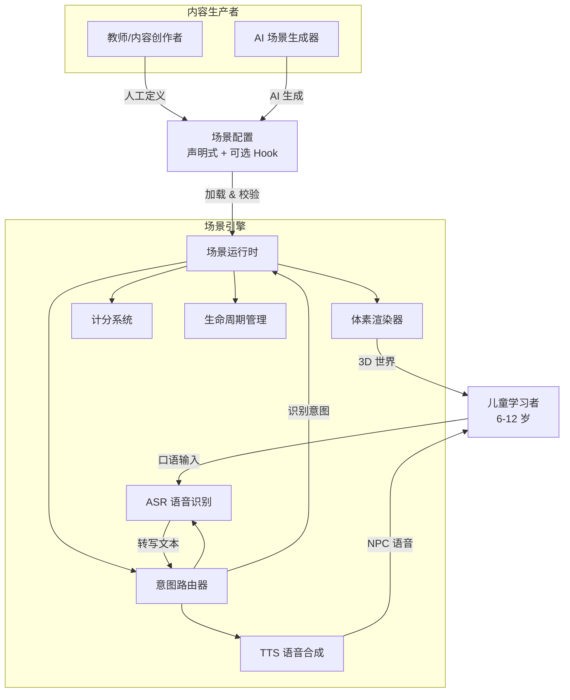

# HiKid.Fun — 需求文档

## Problem Frame

6-12 岁儿童学习英语口语和听力面临双重困境：现有 App 交互浅、留不住（玩两天就丢），线下培训班课时少、开口机会远低于习得所需剂量。传统 2D 界面无法提供足以持续吸引儿童的沉浸式体验。

解决方向：用体素 3D（Minecraft 风格）世界承载新概念英语等教材场景，儿童在其中自由探索、与 NPC 对话——在游戏中自然开口。但手写场景不可规模化，依赖 AI 生成场景又缺乏边界约束。

**引擎的核心定位不是代码复用库，而是场景的语法约束层**——渲染、语音管线、计分、生命周期全部封装，场景作者（人或 AI）只需按约束声明内容即可产出新课程。

---

## Actors

- A1. **儿童学习者 (6-12 岁)**：在体素 3D 世界中自由探索，用英语口语与 NPC 交互完成任务，获得即时反馈和分数。
- A2. **场景作者（教师/内容创作者）**：通过声明式配置定义场景——地图布局、NPC 位置与对话树、任务条件与得分规则。可编写极简 Hook 处理非标准逻辑。
- A3. **AI 场景生成器（LLM）**：接收自然语言描述（如「一个诊所场景，孩子扮演病人描述症状，医生 NPC 问诊开药」），输出符合引擎 schema 约束的有效场景配置。

---

## Key Flows

- F1. **学习会话**
  - **Trigger:** 儿童打开页面，选择或自动进入场景
  - **Actors:** A1
  - **Steps:**
    1. 引擎加载场景配置，渲染体素世界，放置 NPC
    2. 儿童自由走动，靠近 NPC 时触发对话（NPC 通过 TTS 开口）。界面显示麦克风按钮提示儿童回应。
    3. 儿童按下麦克风按钮说话、松开后音频发送给 ASR 转写为文本，意图路由器判定意图
    4. 场景根据意图推进对话树、推进任务状态
    5. 任务完成时触发计分，引擎更新会话得分
    6. 儿童可继续探索或结束会话，引擎显示本次得分
  - **Outcome:** 儿童完成至少一次完整的英语口语交互，获得积分反馈
  - **Covered by:** R1, R5, R6, R7, R9, R14

- F2. **场景定义**
  - **Trigger:** 场景作者（人或 AI）编写场景配置
  - **Actors:** A2, A3
  - **Steps:**
    1. 作者使用声明式配置描述场景（地图、NPC、对话、任务）
    2. 必要时编写极简 Hook 处理超出声明式能力的逻辑
    3. 配置提交到引擎，引擎在加载时执行 schema 校验
    4. 校验通过则场景可用，失败则返回具体错误信息
  - **Outcome:** 新场景配置可被引擎成功加载并运行
  - **Covered by:** R11, R12, R15, R16

- F3. **AI 生成场景**
  - **Trigger:** 作者用自然语言描述一个教学场景
  - **Actors:** A2, A3
  - **Steps:**
    1. 作者提供自然语言描述（如「餐厅点餐」）
    2. AI 根据引擎 schema 约束输出结构化场景配置
    3. 配置提交引擎校验（同 F2 步骤 3-4）
    4. 校验通过后场景即可在引擎中运行
  - **Outcome:** 从自然语言描述到可运行场景，无需手写任何代码
  - **Covered by:** R12, R16, R17

---

## Requirements

### 体素渲染（P0 — V1 必须）

- R1. 引擎提供 Minecraft 风格的体素 3D 世界渲染，支持第一人称或第三人称自由视角漫游。
- R2. 场景由原子方块类型构成——地形方块（草地、水、墙）、道具方块（桌椅、物品）、以及 NPC 实体（带外观和交互能力）。

### 会话生命周期（P1 — V1 基础交互）

- R3. 引擎管理会话状态机：`idle → active → task-in-progress → task-complete → session-end`，状态转换触发对应事件回调供场景 Hook 使用。
- R4. 引擎支持场景加载/卸载/跨场景切换，切换时保留当前会话的计分上下文。

### 语音管线（P0 — V1 核心）

- R5. **TTS 语音合成**：引擎将任意文本合成为 NPC 语音输出，儿童听到 NPC「说话」。采用浏览器端 WebAssembly 方案实现离线 TTS（参考 [Kitten TTS](https://github.com/clowerweb/kitten-tts-web-demo)），无需云端调用。支持调节语速。
- R6. **ASR 语音识别**：引擎通过「按住说话、松开发送」的麦克风按钮采集儿童语音输入，发送到云端 GLM-ASR（智谱 AI）转写为文本。非持续监听模式——儿童主动按下按钮时才录音，松开后音频发送。处理安静环境下的短句识别。
- R7. **意图路由器（Intent Router）**：引擎将 ASR 转写文本 + 对话上下文 + 场景候选意图列表发送给 LLM，LLM 返回命中的意图（或 `none`）。意图在场景配置中以自然语言描述表达（如「孩子点了某样食物或饮料」），不再使用固定枚举标签。这是引擎最核心的约束之一——场景不直接触碰原始文本，只定义语义意图。
- R8. 意图路由器在 LLM 不可用时（网络断开、超时）必须有降级策略：使用本地关键词+规则兜底，或告知场景无法继续并优雅暂停会话。当意图路由器返回 `none`（儿童说了不相干的话或非英语）时，引擎将对话上下文 + 儿童原始 ASR 文本发送给 LLM，由 LLM 生成友好的引导性提问，NPC 通过 TTS 说出来引导儿童重新尝试（如「Sorry, I didn't quite catch that — what would you like to eat? You can say things like『hamburger』or『pizza』」）。最多重试 3 次，3 次后 NPC 示范正确回答并推进对话。

### 统一计分（P0 — V1 核心）

- R9. 引擎追踪每次会话的得分维度：任务完成与否、尝试次数、用词正确性评估。用词正确性通过 ASR 转写文本与期望文本的对比判定——儿童说的话是否表达了正确的意思（意图匹配），而非逐词/逐音节发音分析。场景可配置不同任务的得分权重。
- R10. 引擎在单次会话内追踪和展示得分，会话结束后显示本次得分摘要。跨会话累计和儿童 profile 持久化是上层应用的责任，不在引擎范围内。

### 场景定义（约束层，P1 — V1 基础，P2 — 完整 DSL）

- R11. 场景 = 声明式配置（地图布局、NPC 列表、对话树、任务条件）+ 可选脚本 Hook。声明式部分覆盖 90%+ 的教学场景需求。
- R12. 场景配置 schema 必须足够严格以供 AI 稳定生成，同时足够表达力以覆盖新概念英语全系列的真实教学场景。引擎在加载时执行 schema 校验，拒绝非法配置并给出可读的错误信息。
- R13. NPC 实体定义：位置坐标、外观引用、对话树（意图 → NPC 回应文本序列）、语音配置（音色、语速）、交互触发条件（距离/点击）。
- R14. 任务实体定义：触发条件（前置对话完成 / 进入区域 / NPC 主动发起）、目标意图（儿童需要表达的正确意图）、成功标准（意图匹配 + 可选关键词覆盖）、完成奖励积分。
- R15. Hook 机制：V1 不设计完整 DSL。先在硬编码餐厅场景中暴露 2-3 个显式钩子点（函数调用形式），覆盖非线性分支需求（如「先偷听两个 NPC 对话才能解锁任务」）。DSL 设计推迟到 3+ 个真实场景验证了实际 Hook 模式后再启动。
- R16. 场景配置在加载时执行完整 schema 校验，校验失败返回具体错误（字段级，含行号或路径），场景作者无需反复试错。

### 儿童端辅助 UX（P0 — V1 必须）

- R19. 引擎在麦克风按钮旁展示 2-3 个提示例句气泡（文本），帮助儿童知道可以说什么。场景作者可在对话树中为每个 NPC 提问配置对应的例句列表。低龄段（6-8 岁）支持图片按钮替代纯文本提示。

### 引擎边界（P1 — V1 可用，P2 — 无头测试）

- R17. 引擎暴露 Scene API：`register(sceneConfig)` 注册场景，`activate(sceneId)` 激活场景，`getActiveScene()` 查询当前场景。
- R18. 引擎核心逻辑可脱离 WebGL 运行——支持无头测试模式，仅校验场景配置和驱动对话/计分逻辑，不依赖浏览器渲染。

---

## Acceptance Examples

- AE1. **Covers R1, R5, R6, R7, R9, R14.** 给定一个已加载的「餐厅」场景，8 岁儿童靠近服务员 NPC，NPC 通过 TTS 说「Welcome! What would you like to order?」，界面显示麦克风按钮。儿童按住按钮说「I'd like a hamburger」后松开，音频发送给 ASR 转写，意图路由器判定意图匹配，场景判定任务完成，引擎计分系统 +10 分并在界面上显示。如果儿童说「I want pizza」，意图路由器同样判定为点餐意图，计分系统判定用词正确性通过，+10 分。
- AE2. **Covers R11, R12, R16.** 给定一个场景配置 YAML/JSON 文件，其中 NPC 缺少 `position` 字段——引擎在加载时拒绝该配置，返回错误：「NPC `waiter` 缺少必填字段 `position`」，不进入渲染状态。
- AE3. **Covers R3, R4.** 给定儿童正在「餐厅」场景的任务进行中，引擎状态为 `task-in-progress`。儿童完成点餐任务后，引擎状态转为 `task-complete`，显示得分摘要。儿童选择「离开餐厅」，引擎卸载该场景，保留会话计分上下文。
- AE4. **Covers R13, R14.** 给定一个「诊所」场景配置，定义 NPC 医生在坐标 (5, 0, 3)，对话树包含 `describe_symptom` 意图 → NPC 回应「I see. Let me check.」等 3 个步骤，任务触发条件是儿童靠近医生 2 格以内，目标意图是 `describe_symptom`。

---

## Success Criteria

- 一个 8 岁儿童从打开页面到完成一次餐厅完整的英语对话任务，无需家长辅助。
- 一个非程序员（英语教师）能通过编写纯声明式配置文件，产出一个新的「诊所看病」场景并成功运行。
- 一个 LLM 能从一段自然语言描述生成通过引擎 schema 校验的有效场景配置，且 3 次以内纠错成功率达到 80%。

---

## Scope Boundaries

### Deferred for later

- 多人联机/同伴对话练习模式
- NPC 口型动画 / 角色表情同步
- AR / VR 设备支持
- 场景内容市场 / 社区分享平台
- 家长/教师后台数据看板与学习分析
- 课程序列编排（多个场景的先后顺序依赖）

### Outside this product's identity

- **通用游戏引擎**——不支持物理模拟、粒子特效、骨骼动画等游戏引擎功能。体素渲染仅服务于教学场景的表达需求。
- **课程管理系统**——引擎不负责「先学第 3 课再学第 5 课」这种跨场景的教学编排，那是上层应用的事。
- **语音评测平台**——引擎只做用词正确性检查（是否表达了正确的意思），不做逐音节发音纠正和专业语音评测。

---

## Key Decisions

- **架构路线选择 Hybrid（声明式 + Hook），不选纯声明式也不选 ECS**：纯声明式在「先听 NPC 对话才能解锁任务」这类非线性场景下会膨胀 schema，ECS 的初始架设成本在一个场景的验证阶段无收益。Hybrid 的务实路径：先硬编码一个餐厅场景跑通全链路，观察哪些逻辑是通用的（抽到引擎）、哪些是场景特有的（留在 Hook）、哪些表达为数据的成本极低（放进声明式）。
- **意图路由走 LLM，不走固定分类器**：儿童口语的发音不准、语法残缺特性使代码级意图分类不可靠。场景配置中的意图分支以自然语言描述表达（如「孩子点了某样食物」），引擎运行时将 ASR 文本 + 上下文 + 候选意图发送给 LLM 完成匹配。契约是自然语言语义，不是枚举标签。
- **发音评分降级为用词正确性检查**：ASR 归一化输出使文本差异分析无法可靠检测发音错误（发音变形但可辨认的词不会被捕获）。引擎仅通过 LLM 判断孩子是否表达了正确的意思（意图匹配 + 用词正确），不做逐音节发音纠正——那是专业语音评测平台的事。
- **体素风格选定**：亲和力覆盖 6-12 岁全年龄段，方块级别的粒度适合 AI 生成地图布局，视觉复杂度可控。
- **V1 验证策略**：一个硬编码餐厅场景跑在引擎上，验证「引擎 = 约束层」这个模型是否成立——再决定架构深化的方向。

---

## Dependencies / Assumptions

- **依赖：云端 GLM-ASR（智谱 AI）。** ASR 使用智谱 GLM-ASR（https://docs.bigmodel.cn/cn/guide/models/sound-and-video/glm-asr），无需依赖浏览器内置 Web Speech API。需要评估对中国 6-12 岁儿童英语语音的转写准确率和延迟。
- **依赖：浏览器端 WebAssembly TTS。** TTS 采用 WebAssembly 离线方案（参考 [Kitten TTS](https://github.com/clowerweb/kitten-tts-web-demo)），无需云端调用，免除网络依赖，NPC 语音响应零延迟。需评估音色自然度是否满足儿童场景需求。
- **依赖：Three.js。** 体素渲染层基于 Three.js 构建，不自行实现 WebGL 底层。
- **依赖：LLM — DeepSeek V4 Flash（外部，引擎核心依赖）。** LLM 用于意图路由——每次儿童语音交互需一次 LLM 调用将 ASR 文本匹配到场景候选意图。Push-to-talk 交互模式使延迟要求从实时降为异步。LLM 不可用时引擎降级到本地关键词+规则兜底。
- **假设：目标设备为桌面浏览器（Chrome/Edge）起步，移动端后置。** 若首个场景需要在 iPad 上运行，需在规划阶段评估 Three.js + ASR 在移动端的性能约束。

---

## Outstanding Questions

### Deferred to Planning

- [Affects R6][Needs research] 评估 GLM-ASR 对 6-12 岁中国儿童英语语音的转写准确率（WER）、延迟和成本。规划阶段优先做 gating milestone：收集 50+ 条目标年龄段的英语语音样本做 benchmark。
- [Affects R5][Needs research] 评估 Kitten TTS WebAssembly 方案在目标场景下的音色自然度和多音色支持能力（不同 NPC 是否需要不同声音）。
- [Affects R7][Needs research] 评估 DeepSeek V4 Flash 做意图路由的延迟、准确率和成本。Push-to-talk 模式降低了实时性要求，但 P95 延迟仍需控制在可接受范围内。
- [Affects R11][Needs research] 声明式覆盖率目标验证：V1 后选取 5 个新概念英语场景实测声明式覆盖比例，若 <70% 重新评估 Hook 策略。
- [Affects R12][Technical] 场景配置 schema 格式（JSON Schema / YAML + 自定义校验 / TypeScript 类型定义驱动）。设计阶段加入教学元数据：CEFR 级别/目标词汇清单/预备知识要求。
- [Affects R15][Technical] Hook DSL 设计：语法形式和能力边界——推迟到 3+ 个真实场景验证后，V1 仅做显式函数 Hook。
- [Affects R1][Technical] Three.js 版本选型和构建工具链（Vite/Webpack），体素世界的 Chunk 方案和渲染优化策略。
- [Affects A2][Scoped out] 教师自服务场景创作工具：V1 仅支持开发手写场景配置，教师面向的工具链是 V2 问题。

---

## Next Steps

→ 所有阻塞问题已解决，可以进入 `ce-plan` 进行结构化实现规划。
