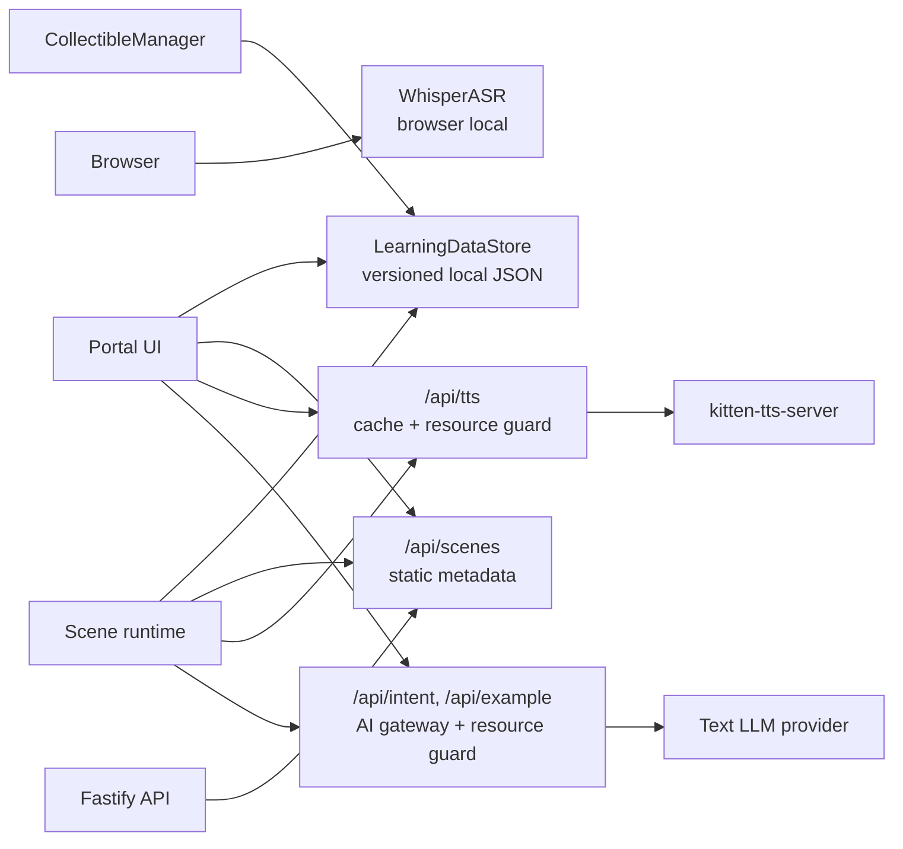

# 成本可控的开源部署与在线体验 — 实现计划

## Overview

本计划把项目从“服务端保存演示数据 + 分散 AI/TTS 调用”的本地 demo 形态，改造成同一套代码同时适配自部署和在线公益体验的产品形态。核心变化是：学习数据归属浏览器，ASR 保持浏览器本地，文本 AI 调用统一经过服务端治理入口，TTS 增加全请求磁盘缓存并纳入宽松资源治理，服务端不再成为用户进度事实来源。

计划按可独立落地的实施单元拆分：先建立浏览器学习数据模型，再迁移 Portal/场景读写路径，然后收敛服务端场景接口，最后补齐 TTS/AI 资源治理、隐私边界、前端额度状态和文档。

---

## Problem Frame

Origin 文档要求同时满足两个目标：自部署用户 clone 后只需要配置一个文本 AI key，本地 ASR 默认可用；在线公益站点提供有限资源，但不能因为服务端 SQLite 共享状态、无限 AI/TTS 请求或散落的 provider 调用导致成本失控（see origin: docs/brainstorms/2026-04-29-cost-controlled-open-deployment-requirements.md）。

当前代码中，用户进度和搜集记录由 `server/src/routes/db.ts`、`server/src/routes/progress.ts`、`server/src/routes/collectibles.ts` 提供，`server/src/routes/scenes.ts` 也把 SQLite 进度混进场景元数据。TTS 在 `server/src/routes/tts.ts` 中每次转发到本机 `kitten-tts-server`，没有缓存和 cache-miss 治理。文本 AI 调用分散在 `server/src/routes/intent.ts` 与 `server/src/routes/example.ts`。ASR 已经在浏览器内由 `src/engine/voice/WhisperASR.ts` 和 `src/engine/voice/SpeechPipeline.ts` 承担，符合第一版本地 ASR 决策。

---

## Requirements Trace

- R1-R7. 浏览器端学习数据、导出/导入/重置、版本化校验、危险操作 UX 和基础可访问性。
- R8-R11. TTS 全请求磁盘缓存、缓存边界、宽松在线资源治理。
- R12-R21. 文本 AI 统一治理、本地 ASR、IP/日额度限制、额度耗尽提示、最小可观测面、key 安全和儿童数据最小化。
- R22-R24. 自部署/在线部署文档、服务端不再是用户数据归属地、场景元数据接口不再作为进度事实来源。

**Origin actors:** A1 儿童学习者, A2 自部署使用者, A3 在线公益站点运营者, A4 引擎/服务端系统

**Origin flows:** F1 本地浏览器保存学习数据, F2 TTS 请求命中磁盘缓存, F3 在线公益额度耗尽, F4 自部署只配置一个文本 AI key

**Origin acceptance examples:** AE1 浏览器数据导出/导入/重置, AE2 TTS 缓存与宽松 cache-miss 限制, AE3 在线额度耗尽, AE4 自部署文本 AI key 与本地 ASR, AE5 场景元数据不混入服务端进度

---

## Scope Boundaries

- 不做账号系统、云同步、家庭成员切换或多人隔离；同一浏览器仍是一份学习数据。
- 不做付费额度、充值、排队或商业化体验。
- 不把 ASR 迁移到 provider；本轮只确认并保护浏览器本地 ASR 路径。
- 不重建 TTS 引擎；继续使用服务端 `kitten-tts-server`，只在代理层增加缓存和治理。
- 不引入复杂运营后台；最小可观测面可以是结构化日志、健康/用量摘要或轻量只读端点。
- 不自动迁移既有共享 SQLite 进度到浏览器，因为当前 SQLite 数据没有浏览器归属。

### Deferred to Follow-Up Work

- provider ASR 或云端 ASR 双模式：需要新的产品决策、隐私评估和额度模型。
- 账号/云同步/家长管理：需要新一轮 brainstorm，不作为本轮隐藏需求。
- 分布式额度存储（Redis/外部 KV）：本轮先做单实例可运行的抽象边界；多实例线上部署可后续替换存储实现。

---

## Context & Research

### Relevant Code and Patterns

- `src/portal/portal.ts` 当前同时请求 `/api/scenes`、`/api/progress`、`/api/collectibles`，并把服务端返回的 `completed`、`score`、`unlocked` 直接用于卡片和图鉴。
- `src/main.ts` 的 `saveProgress()` 在终局对话后 POST `/api/progress`，需要改为写浏览器学习数据。
- `src/engine/collectibles/CollectibleManager.ts` 通过 `/api/collectibles` 获取和写入搜集记录，需要改为依赖浏览器学习数据服务。
- `server/src/routes/scenes.ts` 读取 `getProgress()` 并推导 `completed`、`score`、`unlocked`，是迁移中必须处理的隐藏服务端进度来源。
- `server/src/routes/tts.ts` 已有 TTS 代理和 PCM→WAV 转换，适合在代理层插入缓存、输入约束和资源治理。
- `server/src/utils/quoteGenerator.ts` 已有预生成并写入 WAV 文件的模式，可借鉴文件写入、manifest 校验和 `pcmToWav` 复用方式。
- `src/engine/voice/IntentRouter.ts` 已有本地关键词 fallback，适合作为 AI 额度耗尽或 provider 不可用时的对话降级路径。
- `src/engine/voice/WhisperASR.ts` 已经把 Whisper 模型缓存到 IndexedDB，ASR 决策应保留这一路径，不纳入文本 AI key。
- `tests/headless/*` 使用 Node test + TS import 的轻量 headless 风格，新增核心逻辑测试应继续放在 `tests/headless/`。

### Institutional Learnings

- `docs/solutions/integration-issues/kitten-tts-web-worker-integration-2026-04-26.md` 记录了浏览器端 Kitten TTS 的坑，团队已切到服务端 `kitten-tts-server`。本轮不重新尝试浏览器 TTS，只在现有服务端代理层加缓存与治理。

### External References

- MDN Web Storage API: `localStorage` 是同步 API，较大数据会阻塞 UI；本轮学习数据很小，可以使用单 key JSON，但必须封装并保留未来迁移空间。
- MDN Storage quotas: Web Storage 通常按 origin 有 10 MiB 级别限制，并会在超限时抛 `QuotaExceededError`；导入和写入需要捕获失败。
- Fastify Request docs: `request.ip` 和 `request.ips` 受 `trustProxy` 影响；线上 IP 限制必须显式处理可信代理。
- `@fastify/rate-limit` docs: 默认可按 `request.ip` 做 key，也支持自定义 `keyGenerator` 和错误响应；适合作为 per-IP 频率限制参考，但全站日额度仍需要单独 ledger。
- OWASP Logging Cheat Sheet: 日志可用于反自动化和运营监控，但来自其他 trust zone 的数据需要验证/清洗，敏感 payload 不应直接进入日志。
- DeepSeek API docs: 当前文本 AI 调用仍可按 chat completions 形态封装；返回 JSON 仍应在服务端做结构校验，不能信任模型输出。

---

## Key Technical Decisions

- **浏览器学习数据使用封装后的单文档存储，优先 localStorage。** 当前数据量是场景进度、分数、搜集词汇和时间戳，远小于 Web Storage 限制。用版本化 JSON + 封装层可最快移除服务端 SQLite 依赖；封装层隐藏存储实现，未来可迁移 IndexedDB。
- **浏览器数据服务是唯一学习数据事实来源。** Portal、`src/main.ts`、`CollectibleManager` 都通过同一客户端服务读写进度和搜集记录，避免一处 localStorage、一处内存状态、一处服务端 API 的三套事实。
- **服务端 `/api/scenes` 返回静态场景元数据。** 进度、分数、解锁状态由客户端根据本地学习数据计算。服务端可以保留字段兼容过渡，但客户端不得信任其作为用户状态。
- **既有 SQLite 学习数据不自动迁移。** 它是共享演示数据，无法安全归属到某个浏览器；本轮可删除或停用学习数据路由，必要时保留只读 legacy 说明，不做自动导入。
- **TTS 缓存 key 覆盖输出相关参数。** 缓存 key 至少包含规范化文本、voice、speed、模型版本/路径标识和输出格式，防止旧模型或参数变化返回错误音频。
- **TTS 和文本 AI 共用治理概念，但可分账本。** TTS 的成本是 CPU/磁盘，文本 AI 是 provider 调用和 token；实现上可共享 IP/day ledger 基础设施，但 TTS cache-miss 预算应单独配置且默认宽松。
- **文本 AI 网关统一 DeepSeek 现有模式，不扩大到 ASR。** 第一版把 `intent` 和 `example` 迁到同一 provider client 与 resource governor 下；ASR 保持浏览器本地。
- **日志记录事件，不记录儿童 payload。** 允许记录 route、资源类型、是否命中缓存、是否超限、状态码、耗时和 request id；不记录儿童原始语音、完整 transcript、prompt、provider key 或 Authorization header。

---

## Open Questions

### Resolved During Planning

- 浏览器端学习数据用 localStorage 还是 IndexedDB：本轮使用封装后的 localStorage 单文档存储，因为数据量小、导入导出简单；Whisper 模型缓存继续使用现有 IndexedDB。
- ASR 是否纳入 provider key：不纳入。第一版保留浏览器本地 ASR，provider ASR 后续另议。
- TTS 是否纳入资源治理：纳入，但默认阈值偏宽松，保护正常重听和常见例句朗读。
- 既有 SQLite 数据是否迁移：不自动迁移。它没有用户归属，不能成为浏览器本地数据的来源。

### Deferred to Implementation

- localStorage 单文档的最终字段名和内部 helper 名称：实现时按最小清晰 API 命名。
- TTS 默认阈值的具体数字：先按宽松配置常量实现，实施时根据现有场景的正常请求量设定。
- AI/TTS ledger 的具体存储实现：本轮可用进程内存 + 日期 key，接口保留替换空间。
- DeepSeek key 是否沿用 `DEEPSEEK_API_KEY` 或改名为更通用的文本 AI key：实现时可兼容旧变量并在文档中推荐新变量。

---

## High-Level Technical Design

> *This illustrates the intended approach and is directional guidance for review, not implementation specification. The implementing agent should treat it as context, not code to reproduce.*

---

## Implementation Units

- U1. **Create browser learning data store**

**Goal:** Establish a versioned, validated browser-side source of truth for progress, collectibles, import/export, and reset.

**Requirements:** R1-R7, AE1

**Dependencies:** None

**Files:**
- Create: `src/engine/runtime/LearningDataStore.ts`
- Create: `tests/headless/learning-data-store.test.ts`
- Modify: `src/vite-env.d.ts`

**Approach:**
- Store a single versioned JSON document under a namespaced key such as `hi-kid-fun.learning-data`.
- Model scene progress by scene id and collectibles by scene id + normalized word.
- Include export/import helpers on the same service so import validation, size checks, version checks, and atomic replacement are centralized.
- Treat imported JSON as untrusted: parse into unknown, validate allowed shape, normalize strings, reject unknown incompatible versions, and never partially merge failed imports.
- Catch quota/write failures and return typed results that UI can display without throwing unhandled errors.

**Execution note:** Implement the store test-first; this is the new state authority and is easy to test headlessly.

**Patterns to follow:**
- `src/engine/scoring/ScoreTracker.ts` for small focused state logic with explicit return shapes.
- `src/engine/collectibles/CollectibleManager.ts` normalization helpers for word handling, but keep storage helpers independent of Three.js.

**Test scenarios:**
- Covers AE1. Happy path: empty store initializes with version and no progress/collectibles.
- Covers AE1. Happy path: saving scene progress then reading it returns completed, score, and last played timestamp.
- Covers AE1. Happy path: saving a collectible twice keeps one record for the scene/word pair.
- Covers AE1. Happy path: export from one store and import into a fresh store reproduces progress and collectibles.
- Error path: malformed JSON import returns validation error and leaves current data unchanged.
- Error path: incompatible future version import returns version error and leaves current data unchanged.
- Error path: oversized import returns size error before overwrite confirmation.
- Edge case: reset clears progress and collectibles while preserving a valid empty document.

**Verification:**
- Portal and scene code can depend on a typed learning-data API without directly touching `localStorage`.

---

- U2. **Move Portal progress and compendium to browser data**

**Goal:** Make Portal render progress, scene unlocks, score totals, and compendium counts from `LearningDataStore` rather than `/api/progress` and `/api/collectibles`.

**Requirements:** R1-R7, R23, R24, AE1, AE5

**Dependencies:** U1

**Files:**
- Modify: `src/portal/portal.ts`
- Modify: `src/portal/portal.css`
- Test: `tests/headless/learning-data-store.test.ts`
- Create: `tests/headless/portal-progress-model.test.ts`

**Approach:**
- Keep `/api/scenes` as the source for static scene metadata and target vocabulary.
- Compute `completed`, `score`, total score, collected counts, and scene unlock state from browser data after scenes load.
- Replace `parseCollectibles()` server response handling with local data reads.
- Add a settings/config panel entry near existing Portal controls, but separate it visually and semantically from child play cards.
- Implement export, import, and reset UI states: idle, file selected, validation error, summary before overwrite, success, cancelled, reset confirmation, reset success.
- Use accessible dialogs or dialog-like focus management for destructive confirmations.

**Patterns to follow:**
- Existing `renderCompendiumButton()` and `openCompendium()` in `src/portal/portal.ts` for Portal-owned DOM creation.
- Existing overlay/focus trap pattern in `getCompendiumOverlay()`, while improving new settings dialogs with clearer focus management.

**Test scenarios:**
- Covers AE1. Happy path: static scenes + local progress produce correct total score and completed card state.
- Covers AE5. Happy path: server scene metadata without progress still renders local completed/score/unlocked state.
- Covers AE1. Error path: invalid import reports an error and leaves previous Portal state unchanged.
- Edge case: no local data shows all scenes initial state and compendium count zero.
- Integration: local collectible data drives compendium collected/missing status without fetching `/api/collectibles`.

**Verification:**
- Portal no longer calls `/api/progress` or `/api/collectibles`.
- A fresh browser and a browser with imported JSON show different progress against the same server.

---

- U3. **Move scene runtime and collectible writes to browser data**

**Goal:** Replace scene-end progress POSTs and collectible GET/POST calls with local browser writes.

**Requirements:** R1, R2, R6, R23, R24, AE1, AE5

**Dependencies:** U1

**Files:**
- Modify: `src/main.ts`
- Modify: `src/engine/collectibles/CollectibleManager.ts`
- Modify: `src/engine/collectibles/index.ts`
- Test: `tests/headless/learning-data-store.test.ts`
- Test: `tests/headless/collectible-proximity.test.ts`

**Approach:**
- Replace `saveProgress()` in `src/main.ts` with a local store write using the current scene id, session score, completion flag, and timestamp.
- Pass a learning-data dependency or narrow callbacks into `CollectibleManager` so it can load collected words and mark collection without knowing about storage details.
- Keep current overlay failure behavior, but local write errors should show user-recoverable UI rather than pretending the collectible was saved.
- Preserve browser-local ASR wiring in `src/main.ts`; do not add ASR server calls.

**Patterns to follow:**
- Existing `ScoreTracker` session summary is still the source for what gets persisted.
- Existing `CollectibleManager.fetchCollectedWords()` behavior defines the needed read shape; swap the backend transport, not the collectible placement logic.

**Test scenarios:**
- Covers AE1. Happy path: completing all tasks records scene progress locally.
- Covers AE1. Happy path: confirming a collectible records it locally and hides it on next manager init.
- Error path: storage write failure during collectible confirmation does not mark the marker collected.
- Integration: scene runtime uses local ASR transcription and still sends transcript only to intent routing after ASR completes.

**Verification:**
- Scene gameplay no longer depends on `/api/progress` or `/api/collectibles`.
- Existing collectible placement/proximity tests remain focused on scene logic and do not require a server DB.

---

- U4. **Staticize scenes API and retire server learning-data routes**

**Goal:** Remove service-side learning progress as a product dependency and prevent `/api/scenes` from leaking SQLite-derived user state.

**Requirements:** R22-R24, AE5

**Dependencies:** U2, U3

**Files:**
- Modify: `server/src/routes/scenes.ts`
- Modify: `server/src/index.ts`
- Modify: `server/package.json`
- Modify: `server/package-lock.json`
- Delete or stop registering: `server/src/routes/progress.ts`
- Delete or stop registering: `server/src/routes/collectibles.ts`
- Delete or isolate legacy-only: `server/src/routes/db.ts`
- Modify: `tests/headless/collectibles-db.test.ts`
- Create: `tests/headless/scenes-static-metadata.test.ts`

**Approach:**
- Change `/api/scenes` to return scene id, name, description, CEFR level, target vocabulary, and any static ordering metadata only.
- Remove `getProgress()` from `server/src/routes/scenes.ts`.
- Stop registering progress and collectibles routes once front-end callers are gone.
- Remove `better-sqlite3` dependency if no remaining server path uses it. If implementation keeps a short-lived legacy helper, mark it explicitly as non-product and do not register public routes.
- Preserve quote audio files and TTS server data; those are not user learning data.

**Patterns to follow:**
- Dynamic scene config import pattern in current `server/src/routes/scenes.ts`.
- Route registration style in `server/src/index.ts`.

**Test scenarios:**
- Covers AE5. Happy path: scenes route returns no SQLite-derived completed/score/unlocked values.
- Error path: a malformed scene config is skipped with warning and does not break the route.
- Integration: server can start without `HI_KID_FUN_DB_PATH` or writable progress DB.
- Regression: no public `/api/progress` or `/api/collectibles` route remains required by Portal/scene code.

**Verification:**
- Server package no longer needs `better-sqlite3` for normal app behavior.
- A new online visitor cannot see another visitor's progress through server state.

---

- U5. **Add TTS disk cache and wide resource governance**

**Goal:** Cache all TTS requests by output-affecting inputs and protect online deployments from abusive cache misses without interrupting normal learning.

**Requirements:** R8-R11, R19, AE2

**Dependencies:** None; can land in parallel with U1-U4 after API behavior is agreed.

**Files:**
- Modify: `server/src/routes/tts.ts`
- Create: `server/src/utils/ttsCache.ts`
- Create: `server/src/utils/resourceGovernance.ts`
- Modify: `server/src/utils/quoteGenerator.ts`
- Test: `tests/headless/tts-cache.test.ts`
- Test: `tests/headless/resource-governance.test.ts`

**Approach:**
- Add a TTS cache utility that maps normalized request inputs to a WAV file path plus small metadata record.
- Include text, voice, speed, model path/version identifier, sample rate/output format, and cache schema version in the key.
- Write generated audio atomically to avoid partially written cache files.
- Enforce maximum text length and voice/speed allowlists before cache lookup.
- Track per-IP generation attempts and cache misses separately from cache hits. Cache hits should be cheap and generally allowed even when miss budget is exhausted.
- Provide typed 429 responses with a stable reason code such as `tts_quota_exceeded` or `tts_input_too_large` so front-end messaging can distinguish voice-resource limits from AI limits.
- Reuse the same cache path for quote generation where possible, so pre-generated quotes and runtime TTS do not duplicate work.

**Patterns to follow:**
- `server/src/utils/quoteGenerator.ts` for file existence checks, manifest-ish cache validation, and WAV writing.
- `server/src/utils/audio.ts` for PCM→WAV conversion.

**Test scenarios:**
- Covers AE2. Happy path: first request generates and writes cache; second identical request returns cached WAV without upstream call.
- Covers AE2. Edge case: same text with different speed generates a distinct cache item.
- Error path: text beyond maximum length is rejected before upstream TTS.
- Error path: disallowed voice/speed is rejected before upstream TTS.
- Covers AE2. Error path: repeated unique cache misses from one IP eventually return a typed limit response while cached hits still work.
- Edge case: model version/key change misses old cache and generates fresh audio.

**Verification:**
- Logs and tests can distinguish cache hit, cache miss, upstream failure, and limit rejection.

---

- U6. **Create unified text AI gateway and quota ledger**

**Goal:** Route all text AI provider calls through one server-side gateway with shared limits, safe logging, secret handling, and provider response validation.

**Requirements:** R12, R14-R21, AE3, AE4

**Dependencies:** None; should coordinate response shapes with U7.

**Files:**
- Modify: `server/src/routes/intent.ts`
- Modify: `server/src/routes/example.ts`
- Create: `server/src/utils/textAiGateway.ts`
- Create: `server/src/utils/resourceGovernance.ts`
- Create: `server/src/utils/safeLog.ts`
- Modify: `server/src/index.ts`
- Test: `tests/headless/text-ai-gateway.test.ts`
- Test: `tests/headless/resource-governance.test.ts`

**Approach:**
- Centralize provider config, request construction, response parsing, timeout handling, and JSON validation in `textAiGateway`.
- Support current DeepSeek-compatible chat completions first; keep provider naming generic enough that docs can say “text AI provider” while implementation remains simple.
- Keep provider keys server-only and loaded from environment/deployment secret. Do not expose key values in health responses, logs, or browser payloads.
- Add a resource governance helper with separate buckets for text AI requests and TTS misses; start with in-memory daily counters and per-IP windows, behind a small interface that can be swapped later.
- Add minimal usage summary for operators: counts for text AI accepted/rejected, TTS misses/rejected, current day key, and threshold status. This can be a local-only/admin endpoint or structured logs; the implementation unit should pick the smallest useful surface.
- Sanitize logs: event type, route, resource bucket, status, duration, request id; no transcript, prompt, child utterance, Authorization header, or provider key.
- Keep `IntentRouter.localFallback()` as the front-end fallback when `/api/intent` returns quota/provider errors.

**Patterns to follow:**
- Existing request shapes in `server/src/routes/intent.ts` and `server/src/routes/example.ts`.
- Fastify request IP behavior via `request.ip`, with explicit trust-proxy config if deployment uses forwarded headers.

**Test scenarios:**
- Covers AE4. Happy path: configured text AI key allows both intent routing and example generation through the shared gateway.
- Error path: missing key returns a typed text-AI-unavailable response without exposing secret names beyond safe setup hints.
- Error path: provider invalid JSON returns a typed 502 and does not crash route handler.
- Covers AE3. Error path: daily text AI quota exhaustion returns a typed 429 and increments rejected count.
- Security: logs for AI calls omit transcript/prompt/provider key while retaining event type and status.
- Security: untrusted forwarded IP headers are ignored unless trusted proxy mode is explicitly enabled.

**Verification:**
- `server/src/routes/intent.ts` and `server/src/routes/example.ts` no longer each hand-roll provider fetch, key lookup, or JSON parsing.

---

- U7. **Handle quota and unavailable states in front-end AI surfaces**

**Goal:** Present consistent, understandable quota/unavailable states across dialogue, compendium examples, and TTS playback.

**Requirements:** R11, R16, R18, R21, AE2, AE3, AE4

**Dependencies:** U5, U6 for typed response shapes

**Files:**
- Modify: `src/engine/voice/IntentRouter.ts`
- Modify: `src/engine/voice/TTSEngine.ts`
- Modify: `src/portal/portal.ts`
- Modify: `src/portal/portal.css`
- Modify: `src/main.ts`
- Test: `tests/headless/ai-quota-response.test.ts`

**Approach:**
- Normalize server error reason codes into a small client-side status model: text AI quota exhausted, text AI unavailable, TTS quota exhausted, TTS unavailable.
- For intent routing, preserve local keyword fallback and surface a gentle status only when the child needs to know AI help is paused.
- For compendium examples, show “今日在线 AI 额度已用完” style copy and keep word pronunciation/collected state available when possible.
- For TTS cache-miss quota rejection, distinguish from AI quota: the voice resource is temporarily busy, cached/non-AI interactions still work.
- Avoid logging or rendering full child transcripts in error UI.
- Keep controls either disabled with explanation or clickable with immediate explanation consistently per surface; do not create silent no-ops.

**Patterns to follow:**
- Existing `IntentRouter.localFallback()` for graceful dialogue degradation.
- Existing compendium example bubble in `src/portal/portal.ts`, but avoid `innerHTML` for provider/imported strings where plain text nodes are safer.

**Test scenarios:**
- Covers AE3. Error path: `/api/example` quota response shows quota message and leaves compendium open.
- Covers AE3. Error path: `/api/intent` quota response falls back locally and does not block scene movement.
- Covers AE2. Error path: `/api/tts` TTS quota response shows voice-resource message distinct from AI quota.
- Security: error UI does not echo full transcript or prompt payload.
- Accessibility: quota and import errors are reachable by keyboard/focus and not color-only.

**Verification:**
- Children can continue non-AI scene/Portal interactions after AI/TTS limits are reached.

---

- U8. **Update deployment documentation and environment model**

**Goal:** Make self-deploy and online公益 deployment paths clear, including one text AI key, local ASR, TTS service expectations, cache/limit knobs, and data ownership.

**Requirements:** R5, R13, R17-R22, AE4

**Dependencies:** U4, U5, U6

**Files:**
- Modify: `README.md`
- Modify: `AGENTS.md`
- Modify: `server/package.json`
- Create or modify: `server/.env.example`
- Test expectation: none -- documentation/configuration unit; covered by build/type checks in dependent units.

**Approach:**
- Document two modes: local self-deploy and online公益 deployment.
- State that learning data lives in the browser and export/import JSON is the supported backup/migration path.
- Explain ASR is browser-local in V1; text AI key covers intent routing and example generation.
- Explain TTS remains a server-side local service, with disk cache and wide resource limits.
- Document secret handling: provider key server-side only, no browser config, no exported JSON.
- Document operational knobs: cache directory, model/cache version, per-IP limits, daily text AI budget, TTS cache-miss budget, trusted proxy behavior, and observability surface.
- If legacy env vars remain for compatibility, mark the preferred names and fallback behavior clearly.

**Patterns to follow:**
- Existing README command sections and AGENTS environment-variable format.

**Test scenarios:**
- Test expectation: none -- docs only, but implementation should verify examples match actual env variable names and scripts.

**Verification:**
- A new self-deployer can identify the one text AI key they need, why ASR does not need a provider key, and what TTS service/cache requirements remain.

---

## System-Wide Impact

- **Interaction graph:** Portal and scene runtime move from server progress APIs to `LearningDataStore`; server stays in the loop for static scenes, TTS, and text AI only.
- **Error propagation:** TTS and text AI routes should return typed errors for limit/unavailable states; front-end maps those to non-crashing UI states and local fallback where possible.
- **State lifecycle risks:** Browser data import must validate before overwrite and replace atomically; TTS cache writes must be atomic; quota counters reset by date and should avoid accidental cross-day carryover.
- **API surface parity:** `/api/intent` and `/api/example` should share provider config, quota, logging, and error response conventions. `/api/tts` should share governance conventions but keep TTS-specific budgets.
- **Integration coverage:** At least one end-to-end manual verification should cover fresh browser progress, export/import, scene completion, collectible collection, TTS cache hit, AI quota rejection, and server restart without progress DB.
- **Unchanged invariants:** Scene config schema, local Whisper ASR flow, `ScoreTracker` session scoring, `targetVocabulary`-driven collectibles, and `kitten-tts-server` as the TTS backend remain intact.

---

## Risks & Dependencies

| Risk | Mitigation |
|------|------------|
| `localStorage` write fails or quota is exceeded | Keep data small, catch write errors, show recoverable UI, and centralize writes in `LearningDataStore`. |
| Existing SQLite data appears to disappear | Document that shared demo data is not migrated; users can start fresh or use future explicit import tooling if needed. |
| TTS limits interrupt normal learning | Use high default thresholds, count cache misses separately from hits, and allow cached audio after miss budget is exhausted. |
| In-memory quotas reset on server restart | Accept for V1/self-deploy simplicity; keep ledger interface small so online deployments can swap Redis/KV later. |
| IP limiting is wrong behind a proxy/CDN | Require explicit trusted proxy configuration; fail closed to conservative `request.ip` behavior when unsure. |
| Provider output is malformed | Validate JSON for intent/example responses and fall back to local/typed unavailable states. |
| Sensitive child text leaks into logs | Route all AI calls through safe logging and forbid transcript/prompt payload logging. |
| Removing server routes breaks stale callers | Migrate all front-end callers first; then stop registering server routes and verify repository search finds no `/api/progress` or `/api/collectibles` callers. |

---

## Documentation / Operational Notes

- README should describe “browser data is local” in product language, not only technical storage terms.
- Deployment docs should distinguish text AI provider key from TTS service setup and browser-local ASR.
- Online公益 configuration should expose default limits but mark them as intentionally generous for child learning sessions.
- Operator visibility can start as structured logs plus a minimal usage summary; do not build a dashboard unless later usage demands it.
- No secrets should be printed by startup logs, health checks, or error responses.

---

## Alternative Approaches Considered

- **IndexedDB for learning data:** More scalable and async, but current progress/collectible data is tiny and JSON import/export is central. A localStorage-backed service is simpler now if hidden behind an API.
- **Provider ASR for one-key symmetry:** Gives a cleaner “all AI by provider” story, but sends child audio/transcripts to third party and increases online cost. Browser-local ASR better matches privacy and公益 cost goals.
- **Shared quota for AI and TTS:** Simpler conceptually, but TTS cache hits and text AI calls have different cost profiles. Shared governance code with separate buckets is clearer.
- **Keep server progress APIs as compatibility:** Reduces immediate route deletion work but leaves two sources of truth. Better to remove product dependency once front-end migration lands.

---

## Phased Delivery

### Phase 1: Browser data ownership

- U1, U2, U3, U4. Land browser data store, Portal/scene migration, and static scenes API together or in tightly sequenced PRs. This phase removes shared server progress as a product dependency.

### Phase 2: Resource governance

- U5, U6, U7. Add TTS cache/governance, text AI gateway/governance, and front-end typed limit handling. This phase makes online公益 cost behavior explicit.

### Phase 3: Documentation and cleanup

- U8 plus any dependency cleanup from U4/U6. This phase makes self-deploy and online deployment understandable to new users.

---

## Sources & References

- **Origin document:** docs/brainstorms/2026-04-29-cost-controlled-open-deployment-requirements.md
- Related code: `src/portal/portal.ts`, `src/main.ts`, `src/engine/collectibles/CollectibleManager.ts`, `src/engine/voice/WhisperASR.ts`, `src/engine/voice/IntentRouter.ts`, `server/src/routes/scenes.ts`, `server/src/routes/tts.ts`, `server/src/routes/intent.ts`, `server/src/routes/example.ts`
- Institutional learning: `docs/solutions/integration-issues/kitten-tts-web-worker-integration-2026-04-26.md`
- External docs: MDN Web Storage API (https://developer.mozilla.org/en-US/docs/Web/API/Web_Storage_API), MDN Storage quotas and eviction criteria (https://developer.mozilla.org/en-US/docs/Web/API/Storage_API/Storage_quotas_and_eviction_criteria), Fastify Request reference (https://fastify.dev/docs/latest/Reference/Request/), `@fastify/rate-limit` docs (https://github.com/fastify/fastify-rate-limit), OWASP Logging Cheat Sheet (https://cheatsheetseries.owasp.org/cheatsheets/Logging_Cheat_Sheet.html), DeepSeek Chat Completion API docs (https://api-docs.deepseek.com/api/create-chat-completion)
